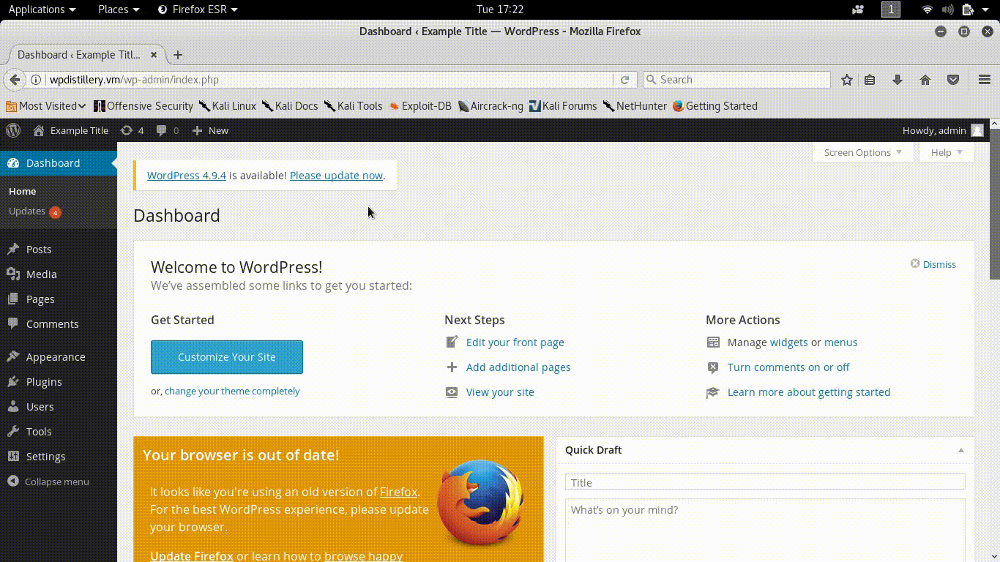

# Project 7 - WordPress Pentesting

Time spent: 12 hours spent in total

> Objective: Find, analyze, recreate, and document three vulnerabilities affecting an old version of WordPress.

## Pentesting Report

1. Comment XSS
  - [x] Summary: Cross-site Scripting vulnerability in the comments section of the website.
    - Vulnerability types: Cross-site Scripting
    - Tested in version: 3.9.2
    - Fixed in version: ?
  - [x] GIF Walkthrough: 
	
  - [x] Steps to recreate: Write a comment. Have the comment approved by the site administrator. After initial comment approval, subsequent
	comments do not need administrator approval. Insert a new comment with an html event.
  - [ ] Affected source code: 
    - [Link 1](https://core.trac.wordpress.org/browser/tags/version/src/source_file.php)
2. Upload New Media XSS
  - [x] Summary: Cross-site Scripting vulnerability in Upload New Media section.
    - Vulnerability types: Cross-site Scripting
    - Tested in version: 3.9.2
    - Fixed in version: ?
  - [x] GIF Walkthrough: 
	
  - [x] Steps to recreate: Save a photo over 2MB. Upload the photo into the Upload New Media in the admin panel.
  - [ ] Affected source code: 
    - [Link 1](https://core.trac.wordpress.org/browser/tags/version/src/source_file.php)
3. DoS
  - [x] Summary: Denial of service vulnerability.
    - Vulnerability types: Denial of service
    - Tested in version: 3.9.2
    - Fixed in version: ?
  - [x] GIF Walkthrough:
	
  - [x] Steps to recreate: Visit Barak Tawily's [proof of concept] (https://baraktawily.blogspot.fr/2018/02/how-to-dos-29-of-world-wide-websites.html). The author provides a tool called [doser.py] (https://github.com/quitten/doser.py) that provides repeated requests to the server. Update doser.py to the target website. 
  - [x] Affected source code: 
    - [Link 1](https://github.com/WordPress/WordPress/blob/master/wp-includes/script-loader.php)

## Assets

No additional assets.

## Resources

- [WordPress Source Browser](https://core.trac.wordpress.org/browser/)
- [WordPress Developer Reference](https://developer.wordpress.org/reference/)

GIFs created with [SimpleScreenRecorder](http://www.maartenbaert.be/simplescreenrecorder/) and [cloudconvert] (https://cloudconvert.com/).

## Notes

Setting up the test environment took more time than anticipated.

## License

    Copyright [2018] [RM50]

    Licensed under the Apache License, Version 2.0 (the "License");
    you may not use this file except in compliance with the License.
    You may obtain a copy of the License at

        http://www.apache.org/licenses/LICENSE-2.0

    Unless required by applicable law or agreed to in writing, software
    distributed under the License is distributed on an "AS IS" BASIS,
    WITHOUT WARRANTIES OR CONDITIONS OF ANY KIND, either express or implied.
    See the License for the specific language governing permissions and
    limitations under the License.
